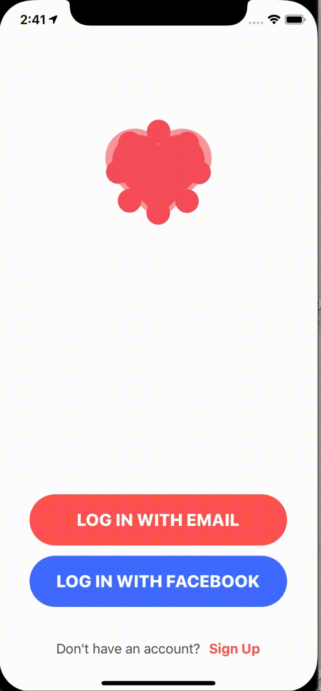
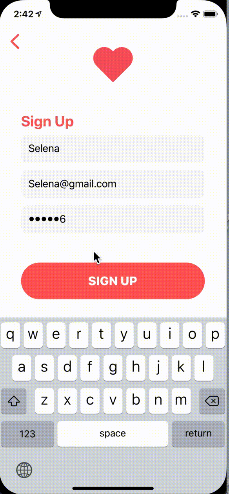
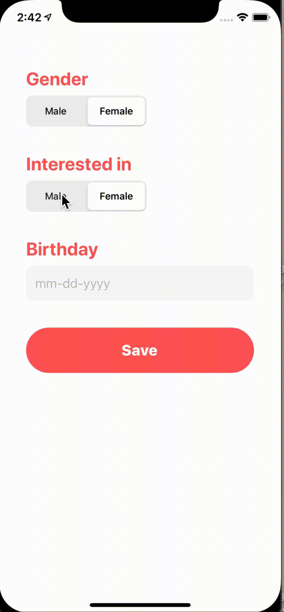
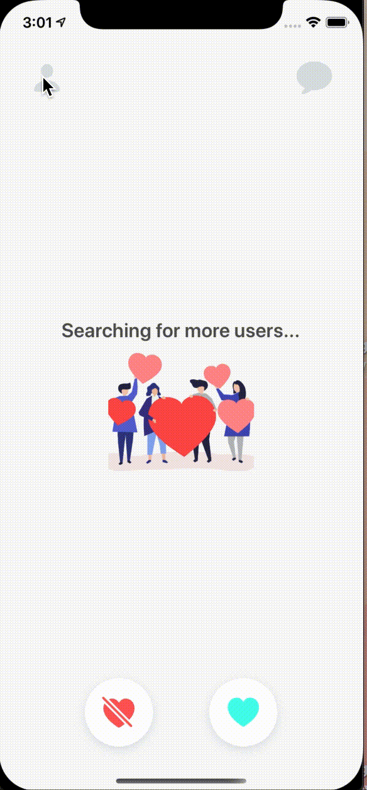
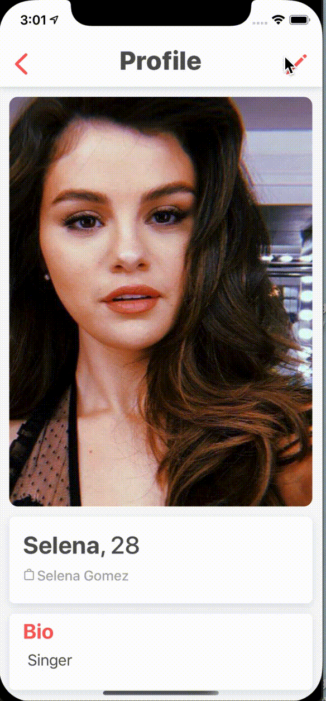
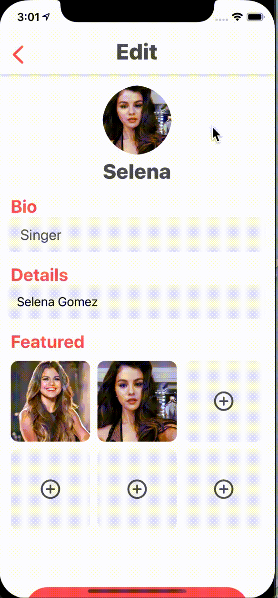

# Dating App
* An iOS online dating platform in Swift 5
* The UI is created programmatically

## Register or Sign In 
You can register new account or sign in to the app via Email or Facebook

## Create a new account

### Fill in basic infomation

## Match Users
Swipe to like or dislike other profiles based on their photos, a small bio, and common interests.

## Send messages, images and videos
* You can type message in the text box, send images and videos in your library. 
* The chat message will be updated in real-time.

## User Profile

## Edit Profile

## Log out 

## Built With
* UIKit
* Firebase Real-time Database 
* AVFoundation
